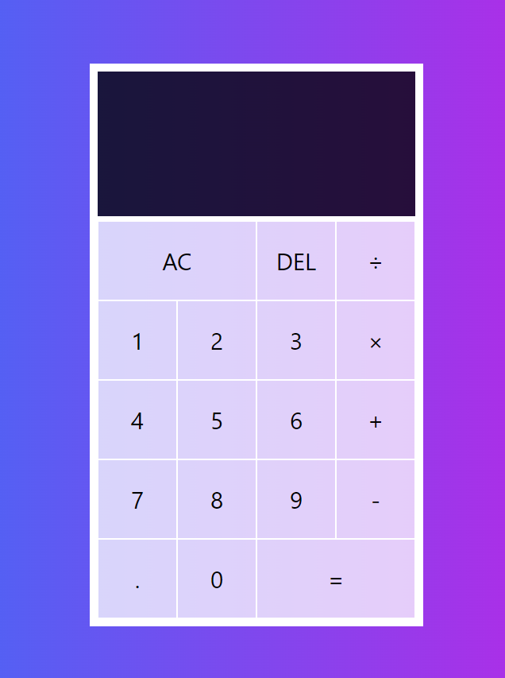

# Vanilla JS Calculator

Live site: [Github Pages](https://tientrinh21.github.io/vanillajs-calculator/)

This is a calculator made with pure HTML, CSS, and Javascrupt

**How to use:**
Pull this repo or download it and open _index.html_ file
